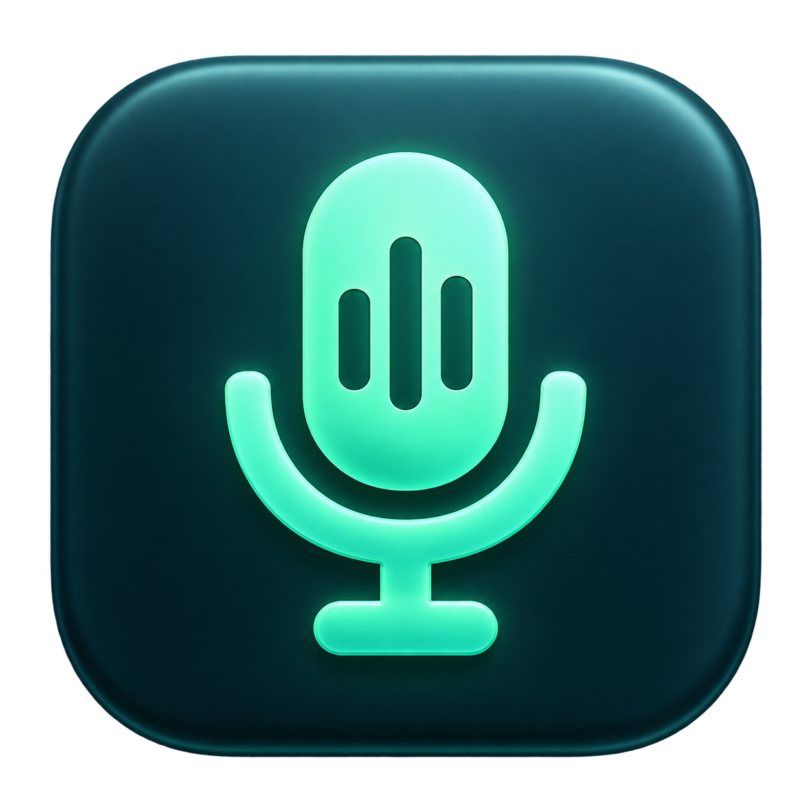

<p align="center">
  
</p>

# Krasp

Krasp is a simple noise-cancellation app for your microphone on macOS.

It works like a lightweight, open-source Krisp-style microphone filter: choose your real microphone in Krasp, turn noise cancellation on, and then select `Krasp Microphone` in Zoom, Discord, Google Meet, OBS, QuickTime, or any other app.

Krasp is built for a focused idea:

```text
Your microphone
      |
      v
Krasp removes background noise
      |
      v
Apps hear Krasp Microphone
```

The processing runs locally on your Mac. Krasp does not send microphone audio to a cloud service.

## What It Does

- Removes background noise from your microphone before other apps hear it.
- Creates a virtual microphone named `Krasp Microphone`.
- Lives quietly in the macOS menu bar.
- Lets you choose the physical input microphone.
- Lets you adjust how strong the noise cancellation should be.
- Shows simple input and reduction meters while it is running.

## Why

Calls, streams, and recordings often pick up fans, keyboard noise, room echo, and other background sound. Krasp is meant to be a small macOS utility that sits between your real microphone and your apps, cleaning the audio path without needing a full audio-routing setup.

It is not trying to be a studio suite. It is a practical microphone noise-cancellation switch for everyday calls and recordings.

## Current Status

Krasp is early-stage macOS audio software. The source is ready for public development, and GitHub Actions builds a macOS installer package when app-affecting files change on `master`.

The current release artifacts are unsigned developer builds. A polished public release still needs Developer ID signing and Apple notarization.

## How It Works

Krasp has two parts:

- `Krasp.app`: the menu-bar app that captures your selected microphone and applies noise cancellation.
- `KraspHAL.driver`: the virtual microphone driver that exposes the cleaned audio as `Krasp Microphone`.

Under the hood, Krasp uses Hush/DeepFilterNet for neural speech enhancement. If the neural runtime cannot load, it falls back to a simpler local DSP path.

More detail is in [Architecture](docs/ARCHITECTURE.md).

## Requirements

- macOS 14 or newer.
- Xcode command-line tools with Swift 6.1 support.
- Rust toolchain with Cargo.
- Internet access for the first neural build, which downloads Hush and clones DeepFilterNet.

## Build

Build the app:

```sh
make app
```

Run it:

```sh
make run
```

Build a macOS installer package:

```sh
make dist
```

Artifacts are written to `dist/`.

## Install The Virtual Microphone

1. Build and launch Krasp with `make run`.
2. Click `Install` in the Virtual Microphone row.
3. Approve the macOS administrator prompt.
4. Select `Krasp Microphone` as the input device in your call, recording, or streaming app.

The app installs its embedded HAL driver to:

```text
/Library/Audio/Plug-Ins/HAL/KraspHAL.driver
```

and restarts CoreAudio so macOS can discover the virtual microphone.

## Release

GitHub Actions builds and publishes a GitHub prerelease when app-affecting files change on `master`. Pushing a tag like `v2026.1.1` also creates a tagged prerelease with the `.pkg` and checksum attached.

Release workflow notes are in [Release](docs/RELEASE.md).

## Third-Party Components

- Hush model by Weya AI, Apache-2.0.
- DeepFilterNet/libDF by the DeepFilterNet authors, Apache-2.0 or MIT.

See [Third Party Notices](THIRD_PARTY_NOTICES.md).

## License

Krasp source code is released under the MIT License. See [LICENSE](LICENSE).
